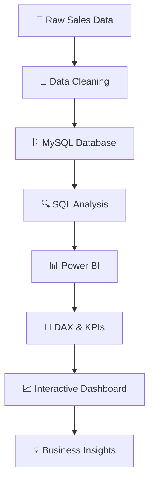

# 📈Sales Dashboard

📊 An interactive *Credit Card Sales & Customer Analytics Dashboard* built using Power BI to analyze revenue, transactions, customer demographics, card categories, spending behavior, and customer segments.

## 📌 Project Overview

The *Sales Dashboard* analyzes credit card transaction and customer data to understand overall business performance and customer behavior.

The project consists of two interactive dashboards:

### 💰 1. Credit Card Transaction Report
Focuses on transaction-level sales performance, revenue, transaction amount, transaction count, card categories, expenditure types, and customer jobs.

### 👥 2. Credit Card Customer Report
Focuses on customer demographics, revenue distribution, income groups, age groups, education, marital status, dependents, gender, and customer jobs.

The dashboards allow users to interactively filter and explore the data using *Quarter, Week Start Date, Gender, Card Category, and Transaction Type*.

---

## 🎯 Project Objectives

- Analyze overall credit card revenue and transaction performance
- Identify high-performing card categories
- Analyze revenue across different customer segments
- Understand customer spending patterns
- Compare revenue across quarters
- Analyze revenue by age, income, education, and occupation
- Identify top-performing states
- Analyze spending by expenditure type
- Provide business insights through interactive dashboards

---

## 🛠️ Tools & Technologies

| Tool | Purpose |
|------|---------|
| 🟡 Power BI | Dashboard & Data Visualization |
| 🟢 Microsoft Excel | Data Cleaning & Preparation |
| 🔵 MySQL | Data Analysis & SQL Queries |
| 🐍 Python | Data Analysis & Data Cleaning |
| 📊 DAX | Measures & KPIs |
| 🔧 Git & GitHub | Project Documentation |

---

# 📊 Dashboard 1 – Credit Card Transaction Report

### 🔑 Key Performance Indicators

| KPI | Value |
|---|---:|
| 💰 Revenue | *57M* |
| 💳 Total Interest | *8M* |
| 💵 Transaction Amount | *46M* |
| 🔢 Transaction Count | *667K* |

### 📈 Analysis Covered

- Revenue by Card Category
- Transaction Amount by Card Category
- Interest Earned by Card Category
- Quarterly Revenue & Transaction Count
- Revenue by Expenditure Type
- Revenue by Education Level
- Revenue by Customer Job
- Revenue by Transaction Type

### 💳 Card Category Analysis

The dashboard analyzes:

- Blue
- Silver
- Gold
- Platinum

This helps identify which card category contributes the most to overall revenue.

---

# 👥 Dashboard 2 – Credit Card Customer Report

### 🔑 Key Performance Indicators

| KPI | Value |
|---|---:|
| 💰 Revenue | *57M* |
| 💳 Total Interest | *8M* |
| 💵 Income | *559M* |
| ⭐ CSS | *3.14* |

### 📈 Customer Analysis

The dashboard provides insights into:

- Revenue by Age Group
- Revenue by Gender
- Revenue by Customer Job
- Revenue by Income Group
- Revenue by Education
- Revenue by Marital Status
- Revenue by Dependents
- Revenue by State
- Revenue by Week
- Revenue by Card Category
- Revenue by Transaction Type

---

# 📌 Important Business Insights

### 💰 Revenue Performance

- Total revenue generated is approximately *57M*.
- Total transaction amount is approximately *46M*.
- Total interest earned is approximately *8M*.
- The dashboard enables quarterly comparison of revenue and transaction volume.

### 💳 Card Category

- *Blue card* contributes the largest share of revenue.
- Silver, Gold, and Platinum categories contribute smaller portions.

### 💸 Transaction Type

Revenue is analyzed across:

- Swipe
- Chip
- Online

This helps understand customers' preferred transaction methods.

### 👨‍💼 Customer Segmentation

Revenue is compared across different customer occupations such as:

- Businessman
- White-collar
- Self-employed
- Government
- Blue-collar
- Retirees

### 🎓 Education Analysis

Customer revenue is segmented by:

- Graduate
- High School
- Uneducated
- Unknown
- Post-Graduate
- Doctorate

### 📍 Geographic Analysis

The dashboard highlights the *Top 5 states by revenue*, helping identify high-performing geographical markets.


# 🔄 Project Workflow





## 🧮 Key KPIs

- Revenue
- Total Interest
- Transaction Amount
- Transaction Count
- Income
- Customer Satisfaction Score

## Repository Structure

 ```text
Sales-Dashboard/
│
├── 📊 Sales_Dashboard.pbix
├── 🖼️ Credit_Card_Transaction_Dashboard_Screenshot.png
├── 🖼️ Credit_Card_Customer_Dashboard_Screenshot.png
├── 📄 credit_card_Dataset.xlsx
├── 🧮 customer_Dataset.xlsx
├── 📊 cc_add_Dataset.xlsx
├── 📄 cust_add_Dataset.xlsx
├── 🗄️ SQL_Queries.sql
└── 📘 README.md
```


## 🎛️ Interactive Filters

The dashboard includes interactive filters for:

- 📅 Quarter
- 📆 Week Start Date
- 👩 Gender
- 💳 Card Category
- 💸 Transaction Type

These filters allow users to perform dynamic analysis and drill down into specific customer and transaction segments.

## 💡 Business Value

This dashboard can help financial businesses:

- ✅ Monitor revenue performance
- ✅ Identify profitable customer segments
- ✅ Understand customer spending behavior
- ✅ Compare card categories
- ✅ Analyze transaction methods
- ✅ Identify high-performing states
- ✅ Understand customer demographics
- ✅ Track quarterly performance
- ✅ Support data-driven decision making

## 📸 Dashboard Preview
Add your dashboard-1 screenshot here:

### 💰Credit Card Transaction Dashboard


Add your dashboard-2 screenshot here:


### 👥Credit Card Customer Dashboard


## 🚀 Skills Demonstrated

- Data Cleaning
- Data Transformation
- Data Modeling
- SQL Queries
- MySQL
- Power BI
- DAX
- KPI Creation
- Data Visualization
- Business Analysis
- Customer Segmentation
- Dashboard Design
- Git & GitHub
